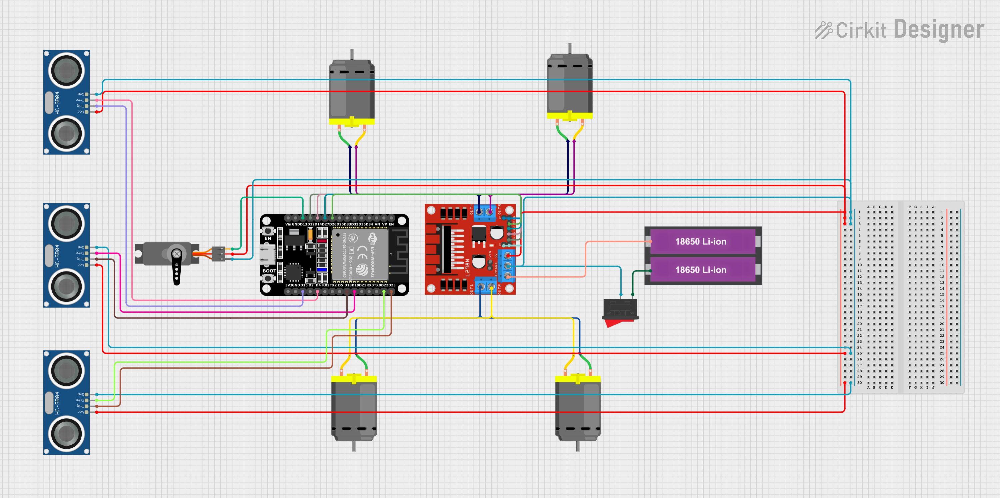

# ESP32 Obstacle Avoidance Robot 🤖🚀

## Version 1.0 🏁

### Build Information 📅
- **Version:** 1.0
- **Release Date:** 01-22-2025
- **Author:** Syntax-Surfer

---

## Project Overview 🎯
This project is an **autonomous robot** using the ESP32, three ultrasonic sensors, an L298N motor driver, and a servo motor. The robot detects obstacles, scans for the best path, and navigates accordingly.

### Key Features ✨
✅ **Real-time object detection** using ultrasonic sensors (Front, Left, Right)  
✅ **Servo-based scanning** to determine the best direction  
✅ **Smooth motor acceleration** with PWM-based speed control  
✅ **Intelligent obstacle avoidance** with decision-making logic  
✅ **PlatformIO Support** for better development and debugging  

---

## Components Used 🧰
- **ESP32 Development Board**
- **L298N Motor Driver Module**
- **Ultrasonic Sensors (HC-SR04) ×3** (Front, Left, Right)
- **Servo Motor (SG90 or MG995)**
- **Two DC Motors** (For wheel movement)
- **Power Supply (Li-Ion Battery)**
- **Jumper Wires & Breadboard**

---

## Circuit Diagram 🖼️

---

## Libraries Required 📚
Install the following libraries in **PlatformIO** before uploading the code:
- **ESP32Servo** (For controlling the servo motor)
- **NewPing** (For ultrasonic sensor distance measurement)

---

## Pin Connections 🛠️

### **Ultrasonic Sensors (HC-SR04)**:
- **Front Sensor**:
  - **TRIG Pin:** GPIO 18
  - **ECHO Pin:** GPIO 19
- **Left Sensor**:
  - **TRIG Pin:** GPIO 15
  - **ECHO Pin:** GPIO 4
- **Right Sensor**:
  - **TRIG Pin:** GPIO 23
  - **ECHO Pin:** GPIO 22

### **Servo Motor**:
- **Signal Pin:** GPIO 13
- **VCC Pin:** 5V
- **GND Pin:** GND

### **L298N Motor Driver**:
- **OUT-1:** GPIO 12
- **OUT-2:** GPIO 14
- **OUT-3:** GPIO 27
- **OUT-4:** GPIO 26

---

## How to Run the Project 🚀
1. **Set up PlatformIO** in VS Code and create a new ESP32 project.
2. **Install required libraries** (ESP32Servo & NewPing) in PlatformIO.
3. **Connect the components** according to the wiring diagram.
4. **Compile and upload** the code to the ESP32 via USB.
5. **Power the ESP32 and motor driver** using an external power source.
6. **Observe the robot's movement** and obstacle detection.

---

## Adjustable Parameters 🔧
- **OBJECT_THRESHOLD_FRONT, OBJECT_THRESHOLD_LEFT, OBJECT_THRESHOLD_RIGHT**: Distance threshold (in cm) for object detection.
- **OBJECT_DETECTION_DELAY**: Delay after object detection (for better response time).
- **LOOK_ANGLE**: Maximum servo rotation angle.
- **SPEED_INCREMENT**: Motor speed ramp-up step (to prevent sudden jerks).

---

## Contact Information ✉️
For further inquiries or collaboration, feel free to reach out:
- **Email:** [yaxpatel6300@gmail.com](mailto:yaxpatel6300@gmail.com)
- **GitHub:** [Syntax-Surfer-1](https://github.com/Syntax-Surfer-1) 🌐

📌 *Feel free to fork the repository and contribute!* 🚀
